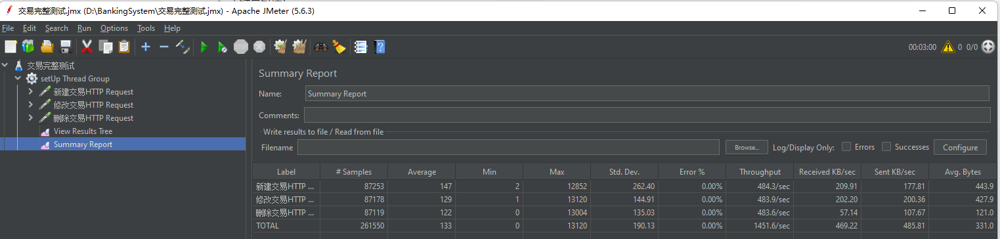
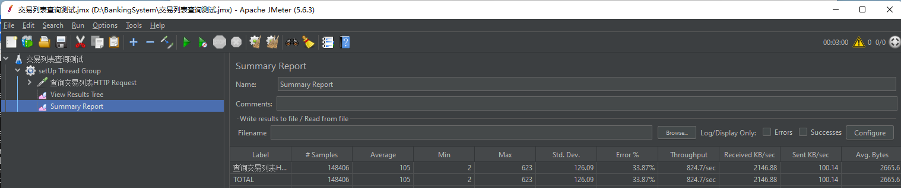

# 银行交易管理系统

这是一个基于Spring Boot的银行交易管理系统，提供交易记录的创建、查询、更新和删除功能。

## 技术栈

- Java 21
- Spring Boot 3.2.3
- Spring Data JPA
- H2 Database
- Spring Cache (Caffeine)
- SpringDoc OpenAPI (Swagger)
- Lombok
- Guava
- JUnit 5
- Mockito

## 功能特性

- 交易的CRUD操作
- 分页查询
- 缓存支持
- API文档（Swagger）
- 输入验证
- 异常处理
- Docker支持

## 快速开始

### 前提条件

- JDK 21
- Maven 3.8+
- Docker (可选)

### 构建和运行

1. 克隆项目
```bash
git clone git@github.com:wersonz/BankingSystem.git
```

2. 进入项目目录
```bash
cd BankingSystem
```

3. 构建项目
```bash
mvn clean install
```

4. 运行项目
```bash
mvn spring-boot:run
```

### Docker部署

1. 构建Docker镜像
```bash
docker build -t banking-system:latest .
```

2. 运行容器
```bash
 docker run -d -p 8080:8080 --name banking-app banking-system:latest
```

### API文档

启动应用后，访问以下地址查看API文档：
- Swagger UI: http://localhost:8080/swagger-ui.html
- OpenAPI文档: http://localhost:8080/v3/api-docs

## 项目结构

```
src/
├── main/
│   ├── java/
│   │   └── com/
│   │       └── banking/
│   │           ├── BankingSystemApplication.java
│   │           ├── config/          # 配置类
│   │           ├── controller/      # REST控制器
│   │           ├── service/         # 业务逻辑
│   │           ├── entity/          # 数据库实体
│   │           ├── dto/             # 数据传输对象
│   │           ├── mapper/          # 对象映射
│   │           ├── repository/      # 数据访问层
│   │           ├── exception/       # 异常处理
│   │           └── enums/           # 枚举类
│   └── resources/
│       └── application.yml
└── test/
    └── java/
        └── com/
            └── banking/
                └── controller/     # 交易接口单元测试
                └── service/        # 交易service类单元测试
```

## 依赖说明

- spring-boot-starter-web: Web应用支持
- spring-boot-starter-validation: 数据验证
- spring-boot-starter-cache: 缓存支持
- spring-boot-starter-data-jpa: JPA支持
- h2database: 内存数据库
- springdoc-openapi-starter-webmvc-ui: API文档
- lombok: 减少样板代码
- guava: Google核心库，
- caffeine: 高性能缓存库
- spring-boot-starter-test: 测试支持

## 测试

### 运行单元测试：
```bash
mvn test
```

### 压力测试
- 运行环境: centos7.9虚拟机
- 运行资源: 2CPU 2GB内存
- 测试方式: jmeter压测
- 压力测试报告

| 测试点                       | 并发访问线程数 | 吞吐量(每秒) |
| ---------------------------- | -------------- | ------------ |
| 新增交易->更新交易->删除交易 | 200            | 480          |
| 交易列表查询                 | 100            | 820          |

- jmeter报告



